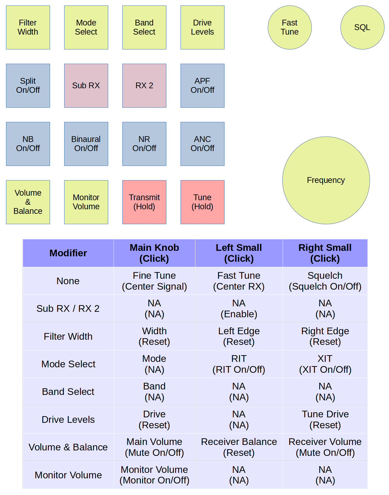

# midi-to-tci
Allows a MIDI controller to generate TCI commands to control a capable radio.

### Controller Details
Currently, the controller mappings are hardcoded and based around a specific controller and layout.
Any controller could be used but the code would need to be updated to make specific mappings.

I am using the [DOIO KB16-01 Rev2](https://www.whatgeek.com/products/doio-kb16-01-macro-keyboard-16-keys-3-knob-macro-pad) keypad, also known as the [Megalodon Triple Knob Macro Pad](https://www.keebmonkey.com/products/megalodon-triple-knob-macro-pad), which is available from multiple sources.

To use it as a MIDI controller, I deployed a custom QMK keymap that can be found at https://github.com/ars-ka0s/qmk_firmware.
After cloning that fork, it can be built with `qmk compile -kb doio/kb16/rev2 -km ars-ka0s` and installed with `qmk flash` after plugging the device in while holding down the top left key.

This maps the 16 keys to MIDI CC messages, sending a value of 127 for Key Down and 0 for Key Up, corresponding to CCs 102 through 117.  The three knobs are CCs 20, 21, and 22 and send values of 63 for Click, 21 for Scroll Left, and 105 for Scroll Right.

### Layout Details

The knobs are used for many different features by holding down one of the keys while turning one of the knobs.

The first row keys -- Filter Width, Mode Select, Band Select, and Drive Levels -- all act this way.  The first two on the bottom row, Volume/Balance and Monitor Volume, also follow this convention.

Other buttons, such as the first and last on the second row -- Split On/Off and APF On/Off -- are simple toggles.  The entire third row are toggles for other filters -- NB, Binaural, NR, and ANC.

The last two buttons on the bottom row are momentary buttons: the left acting as a Transmit Push-to-Talk and the right triggering the Tune tone.

The remaining two buttons, the middle of the second row, act as additional modifiers to apply actions to either the B SubRX or the RX2 second receiver.  If the select action doesn't support specifiying control based on specific SubRX or RX, the modifier is just ignored.
